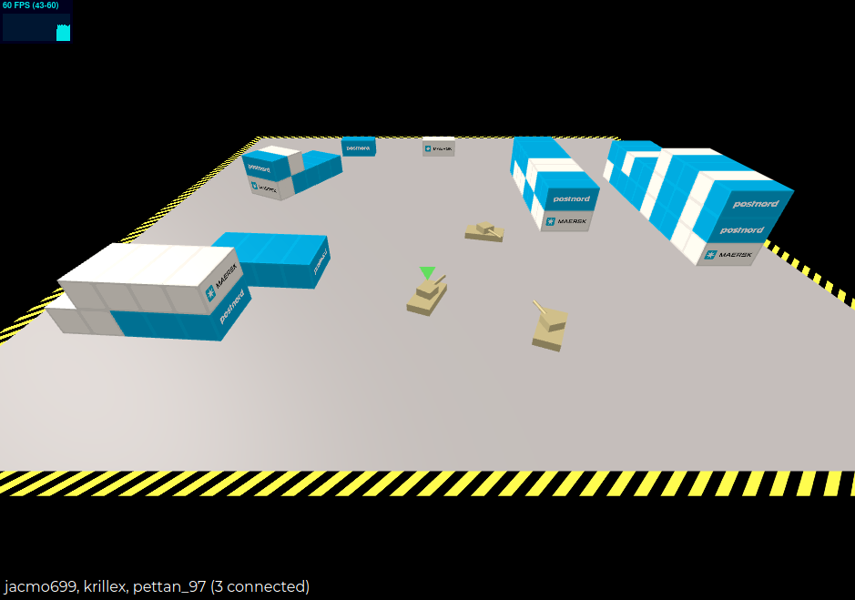

# game



## Client
TODO

## Server
TODO

### Makefile:

Build server + wasm
```
make build
```

Build wasm part only
```
make wasm
```

Run server
```
make run
```
## Misc


Go target = wasm
```
GOOS=js GOARCH=wasm go build -o main.wasm
```

https://github.com/golang/go/wiki/GoArm

https://developer.valvesoftware.com/wiki/Source_Multiplayer_Networking


## SSH

1. HOST
    - create ssh-key: <em>ssh-keygen -t rsa -b 4096 -C "your_email@example.com"</em>
    - create authorized_keys file in ~/.ssh/authorized_keys containing public key (id_rsa.pub)
    - ensure: .ssh => chmod 700
    - ensure: authorized_keys => chmod 600

2. GITHUB
    - add private key to secrets


rsync -vah ./build/ pi@slarsson.me:/home/pi/nginx/www/tanks/ --delete
