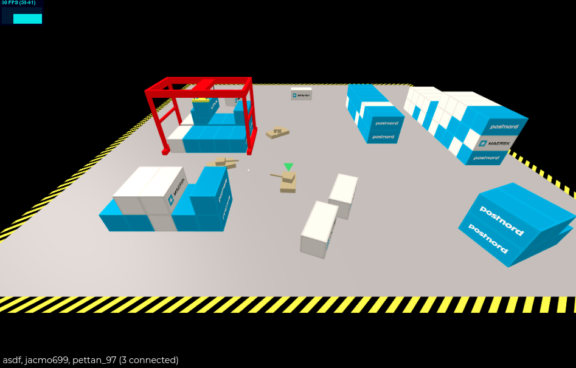

# tanks
DEMO: http://game.samuel.yoga

Simple online multiplayer game created with Go, TypeScript and WebAssembly.




## `./client`
Run build
```sh
npm run build
```

Start dev (expects the server to be running on port 1337)
```sh
npm run dev
```

## `./server`
Go version = 1.15

### Makefile:
Run server
```sh
make run
```

Build server + wasm
```sh
make build
```

Build wasm part only + sync main.wasm with client
```sh
make wasm
```

Build for arm-processors (32-bit) 
```sh
make arm
```
&nbsp;

## #inspo
https://www.youtube.com/watch?v=ZyGw1yLNO9E

https://github.com/awdng/triebwerk

## URLs

https://github.com/golang/go/wiki/GoArm

https://developer.valvesoftware.com/wiki/Source_Multiplayer_Networking

https://www.digitalocean.com/community/tutorials/how-to-configure-ssh-key-based-authentication-on-a-linux-server
